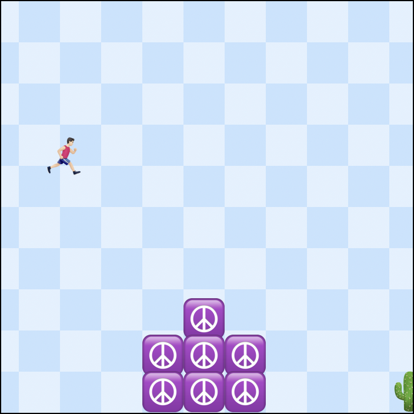

# Supermario

This is a Supermario jump and run game implemented in [Svelte](https://svelte.dev). You can visit it at https://gregorw.github.io/supermario/.



## Getting started

On Mac OS X Nodejs and Yarn are required:

```
brew install node yarn
```

Then, use Git to clone this code:

```
git clone https://github.com/gregorw/supermario.git
cd supermario
```

Within the project folder install packages and run dev server:

```
yarn install
yarn dev
```

Your local copy should now be running at http://localhost:5000/supermario/.

## Challenges

1. Can you change the player icon to something that represents you better?
1. Can you create your own world?
1. Can you make the player jump?
1. Can you detect collisions and display “Game Over”?

Have fun coding and don’t hesitate to contact me when you are about to learn to program and need some help.
